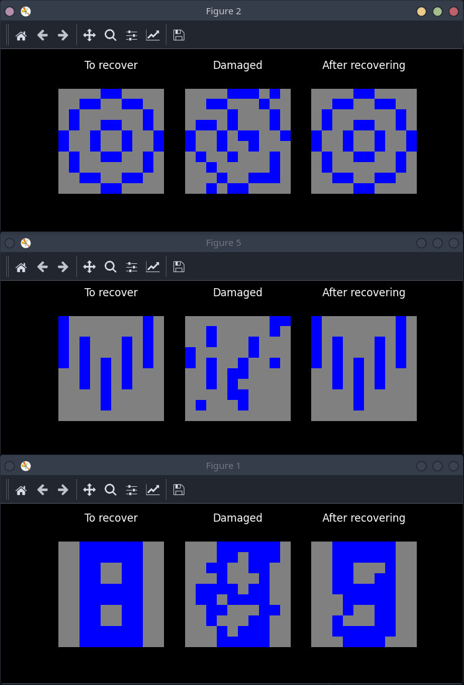
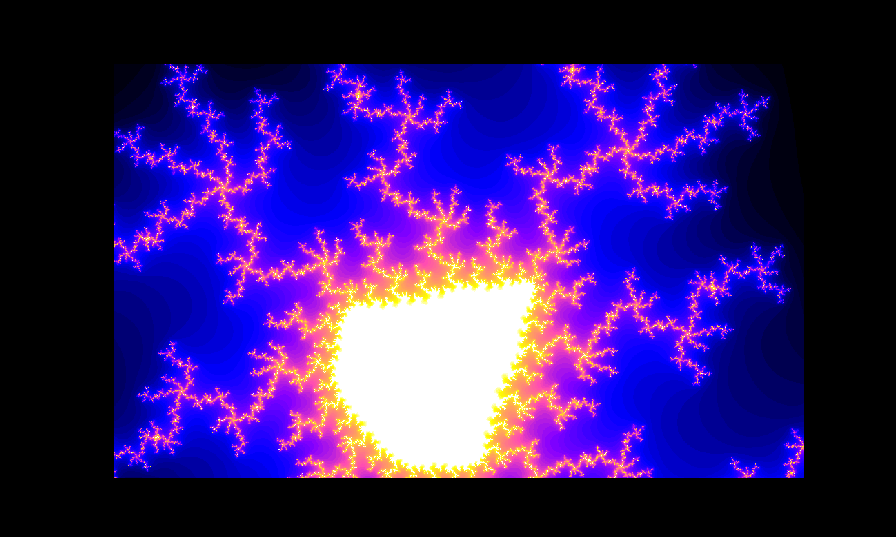

# NAVY
Tasks for a college course titled Nekonvenční Algoritmy a Výpočty (Unconventional Algorithms and Computation).

The subject encompassed basics of neural networks, how a perceptron works, reinforcement-learning techniques and lastly generating 2D or 3D images using fractal geometry.

### Task list:
1. Perceptron (sorts points above/under the line)
2. XOR function using 3 perceptrons
3. Hopfield network
4. Q learning (reinforcement learning) - Find the cheese
5. L-systems
6. IFS (Iterated function system) fractals
7. TEA (Time escape algorithm) - Mandelbrot set zoom
8. 2D Landscape generator

## Usage and requirements
Python 3.7 or newer, Matplotlib, Tkinter, Turtle (for some tasks)

## Screenshots

